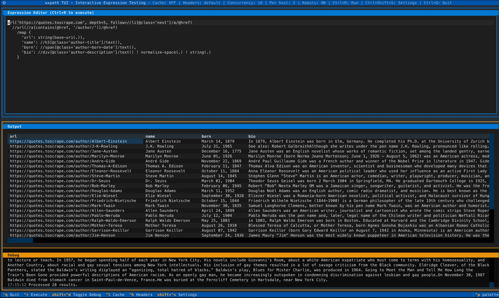

# wxpath TUI - Quick Start Guide

**Get started with the wxpath TUI in 5 minutes!**

> NOTE: I highly recommended you enable caching (Ctrl+L) for faster execution, and set `url('...', depth=...)` for capped crawls to be polite to the servers you are crawling.


## Step 0: Preview

  
  <figcaption markdown="span">
      Wxpath TUI Demo screenshot
  </figcaption>


## Step 1: Install Dependencies

```bash
# Install textual (required for TUI)
pip install textual

# Or install wxpath with TUI support
pip install -e ".[tui]"
```

## Step 2: Launch the TUI

```bash
# Using command (if installed)
wxpath-tui

# Or as module
python -m wxpath.tui
```

## Step 3: Your First Expression

### In the TUI:

1. **Top panel** shows an example expression
2. **Press Ctrl+R or F5** to execute
3. **Bottom panel** shows results
  a. Debug panel shows debug messages

### Try These Expressions:

**Example 1: Extract Text**
```python
url('https://quotes.toscrape.com')//span[@class='text']/text()
```

**Example 2: Extract as Table**
```python
url('https://quotes.toscrape.com')//div[@class='quote']/map {
  'quote': .//span[@class='text']/text(),
  'author': .//span[@class='author']/text()
}
```

**Example 3: Follow Links**
```python
url('https://quotes.toscrape.com')
  ///url(//a/@href)
    //h3/text()
```

## Keyboard Shortcuts

| Key | Action |
|-----|--------|
| `Ctrl+R` or `F5` | Execute expression |
| `Escape` | Cancel crawl (keep partial results) |
| `Ctrl+C` | Clear output |
| `Ctrl+Q` | Quit |

## Understanding Output

### "Waiting" State
The TUI shows "Waiting" when:
- Expression is empty
- Missing closing parentheses, brackets, or braces
- Unclosed quotes

### Valid Expression
Shows green message when expression is complete and ready to execute.

### Results Display

**Text Results:**
```
Result 1:
  "The world as we have created it..."

Result 2:
  "It is our choices that show..."
```

**Table Results (from `map {...}`):**
```
┌─────────────────────────────────┬──────────────────┐
│ quote                           │ author           │
├─────────────────────────────────┼──────────────────┤
│ "The world as we have..."       │ Albert Einstein  │
│ "It is our choices..."          │ J.K. Rowling     │
└─────────────────────────────────┴──────────────────┘
```

**HTML Elements:**
```
Result 1:
  <div class="quote">
```

## Common Issues

### Issue: "command not found: wxpath-tui"
**Solution:**
```bash
# Run as module instead
python -m wxpath.tui
```

### Issue: "No module named 'textual'"
**Solution:**
```bash
pip install textual
```

### Issue: "Timeout after 30s"
**Solution:**
- The site may be slow or unresponsive
- Try a faster/local site first
- Use the demo: `python demo_tui.py`

### Issue: "No results returned"
**Solution:**
- Expression is valid but found no matches
- Check XPath selectors
- Verify URL is accessible
- Try simpler expression first

## Tips for Success

### 1. Start Simple
```python
# Begin with basic extraction
url('https://example.com')//h1/text()
```

### 2. Add Complexity Gradually
```python
# Then add map structure
url('https://example.com')//article/map {
  'title': .//h1/text()
}
```

### 3. Cancel Long Crawls
- Press **Escape** to stop a running crawl at any time
- Partial results stay in the table; a status line shows how many were received

### 4. Test Incrementally
- Execute after each change
- Verify results before adding more
- Use Ctrl+C to clear between tests

### 5. Watch Validation
- Green = ready to execute
- Yellow = incomplete or error
- Bottom panel shows helpful messages


## Next Steps

### Learn More
- Read [index.md](/docs/tui/index.md) for detailed features
- See [examples.md](/docs/examples.md) for more expressions

### Explore wxpath
- [Getting Started](/docs/getting-started.md)
- [Language Design](/docs/guide/language-design.md)
- [Examples](/docs/examples.md)

### Get Help
- Check [wxpath docs](https://rodricios.github.io/wxpath/)
- Report issues on [GitHub](https://github.com/rodricios/wxpath/issues)
- Review error messages in TUI
- Try simpler expressions first

## Quick Reference Card

```
┌─────────────────────────────────────────────────────────┐
│              wxpath TUI Quick Reference                 │
├─────────────────────────────────────────────────────────┤
│ COMMANDS                                                │
│   wxpath-tui              Launch TUI                    │
│   python -m wxpath.tui    Alternative launch            │
│   python demo_tui.py      Offline demo                  │
│                                                         │
│ KEYBOARD                                                │
│   Ctrl+R, F5              Execute expression            │
│   Escape                  Cancel crawl (keep results)   │
│   Ctrl+C                  Clear output                  │
│   Ctrl+Q                  Quit                          │
│                                                         │
│ EXPRESSIONS                                             │
│   url('...')//tag         Extract elements              │
│   url('...')//tag/text()  Extract text                  │
│   url('...')//tag/@attr   Extract attributes            │
│   url('...')//tag/map{..} Extract as dict/table         │
│   ///url(...)             Follow links (crawl)          │
│                                                         │
│ OUTPUT                                                  │
│   Text → List of strings                                │
│   Dict → Table with columns                             │
│   HTML → Partial element (300 chars)                    │
│   Error → Clear message                                 │
│                                                         │
│ LIMITS                                                  │
│   Results: 10 items max                                 │
│   Depth: 1 level max                                    │
│   Timeout: 30 seconds                                   │
│   Table: 50 rows max                                    │
└─────────────────────────────────────────────────────────┘
```

## Success!

You're now ready to use the wxpath TUI for interactive expression testing!

**Happy crawling! 🕷️✨**

---

For detailed documentation, see:
- [index.md](/docs/tui/index.md) - Full user guide
- [examples.md](/docs/examples.md) - More examples
